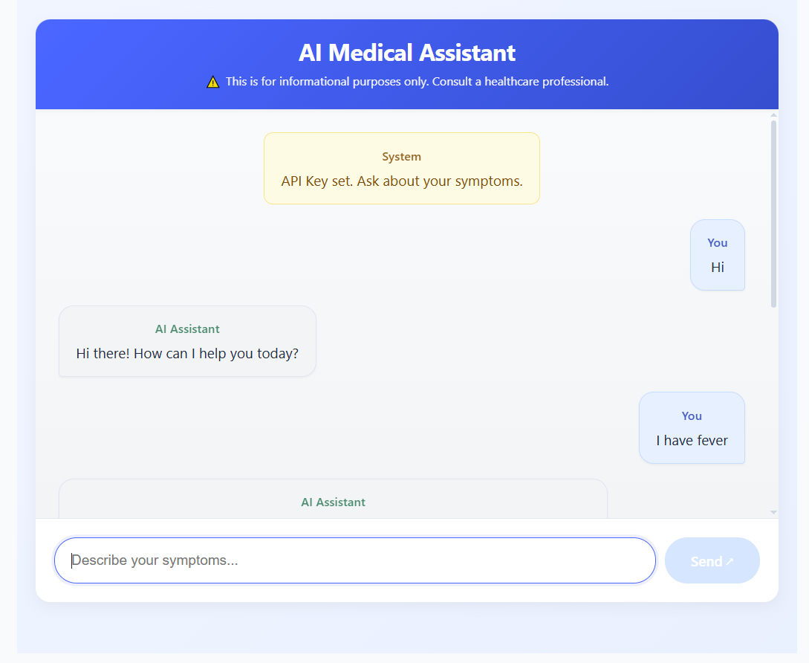
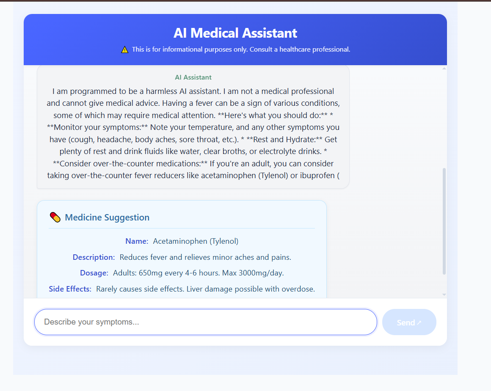

# 🧠 AI Doctor Chatbot

A smart AI-powered health assistant built using **React + Vite**, integrated with **Gemini API** and a local JSON-based database to provide medical suggestions based on symptoms like fever, cold, cough, and more.

## 🚀 Live Demo
[Click here to try the chatbot](https://ai-doctor-chatbot.vercel.app/) 

---

## 🔐 Getting Started with Gemini API
To use this project, you need an API key from Gemini (Google AI). Follow these steps:

Go to the Gemini API Console:
[Gemini API KEY](https://aistudio.google.com/app/apikey)

Sign in with your Google account.

Click “Create API Key” and copy the generated key.

---

## 📌 Features

- 🤖 Conversational chatbot for common health symptoms
- 🔍 Suggests remedies, precautions, and alternatives
- 🧠 Powered by Gemini AI + Local symptom mapping
- 💬 Real-time response with context-aware answers
- 📱 Fully responsive UI with clean interface

---

## 🛠️ Tech Stack

| Tech             | Role                            |
|------------------|---------------------------------|
| React + Vite     | Frontend Framework              |
| Gemini API       | AI Conversational Engine        |
| package.json     | Acts as Local Database          |
| JavaScript (ES6) | Logic & Functionality           |
| CSS              | UI Styling                      |

---

## 🧪 How It Works

1. User types a symptom (e.g. “I have fever”)
2. App checks the local DB (package.json) for mapped remedies
3. Gemini API generates a natural language response
4. Output is displayed on the chat screen

---

## 🖼️ Project Poster

[📄 View Poster (PDF)](POSTERAIDOCTOR.pdf)

---

## 🖼️ Screenshots

---

## ✅ Results

- ✔️ Responses generated in ~1 sec
- ✔️ Accurate suggestions for test cases like fever, cough, cold, etc.
- ✔️ Gemini + JSON integration worked seamlessly
- ✔️ Responsive and intuitive interface

---

## 📌 Future Scope

- 🎙️ Add voice input support
- 🌍 Include multilingual response generation
- 🩺 Integrate real-time doctor appointment APIs
- 📊 Add symptom severity check using ML

---

